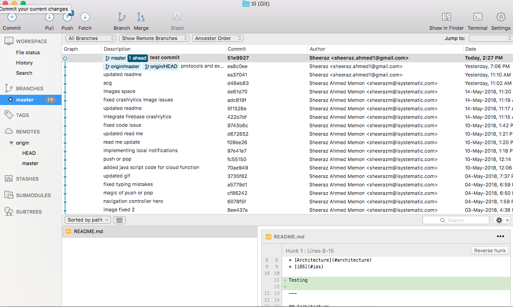

# How to Uncommit a commit in git

Sometimes it happens that you mistakenly commit the files, now you want to uncommit some files. 



To uncommit these files use the following command in terminal/command prompt 

```git
git reset --soft HEAD^

```


### Resources:
* https://stackoverflow.com/questions/2845731/how-to-uncommit-my-last-commit-in-git