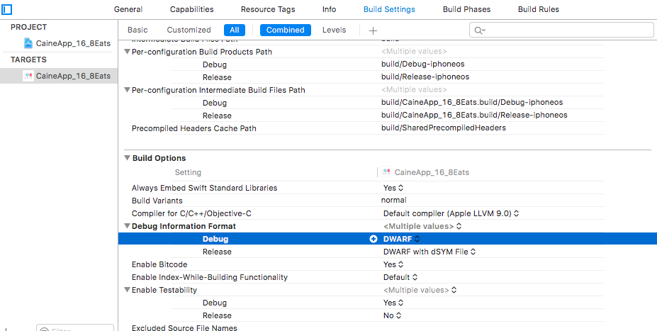
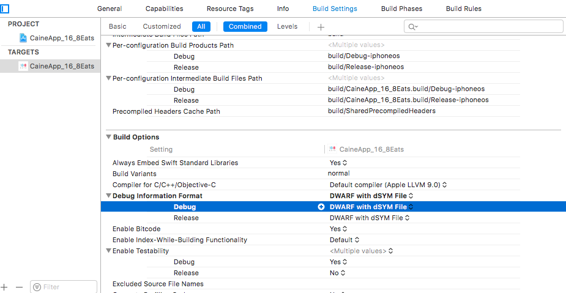

# How to integrate Firebase Crashlytics in iOS


### Requirements
* Physical Device will helpful but not necessary

### Steps:
* Add Pod
    ```
    # Pods for Firebase Crashlytics
    pod 'Fabric', '~> 1.7.6'
    pod 'Crashlytics', '~> 3.10.1'
    ```
* Open Command Line/ Teminal and Run the following commands
    ```
    pod repo update
    pod install

    ```
    
The frameworks you added include a run script that initializes Crashlytics. Add it to your project's build phases:

1. Open your project in Xcode, and select its project file in the Navigator.
2. Select your main build target from the **Select a project or target** dropdown.
3. Open the target's **Build Phases** tab.
4. Click **+ Add a new build phase**, and select **New Run Script Phase**.
5. Add the following line to the **Type a script...** text box:

```
"${PODS_ROOT}/Fabric/run"

```
### Notes
The Firebase crashlytics does not work in debug to make it run for debug crashes change the following settings:

1. Open your project in Xcode, and select its project file in the Navigator.
2. Select your main build target from the **Select a project or target** dropdown.
3. Open the target's **Build Settings** tab.
4. Go scroll the page to the **Build Options** and find **Debug Information Format**, change the debug from **DWARF** to **DWARF with dSYM file**






### Resources
* https://firebase.google.com/docs/crashlytics/get-started